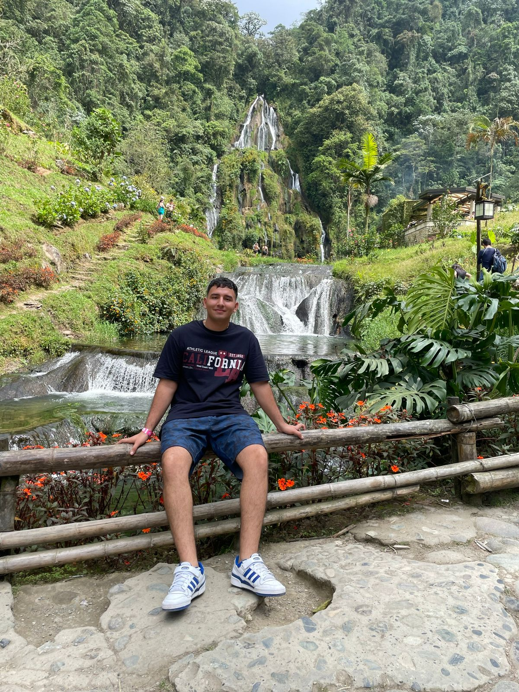
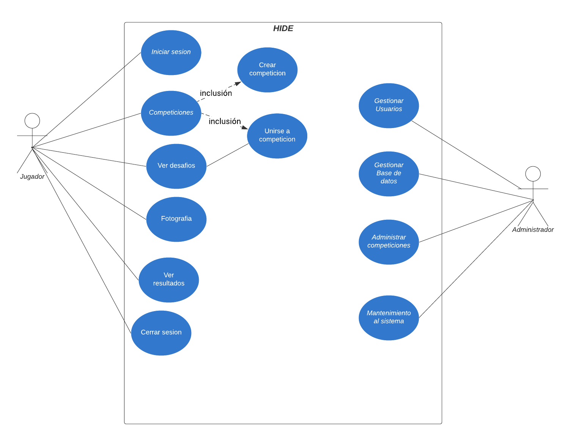
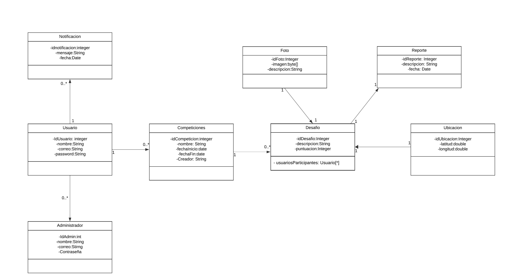
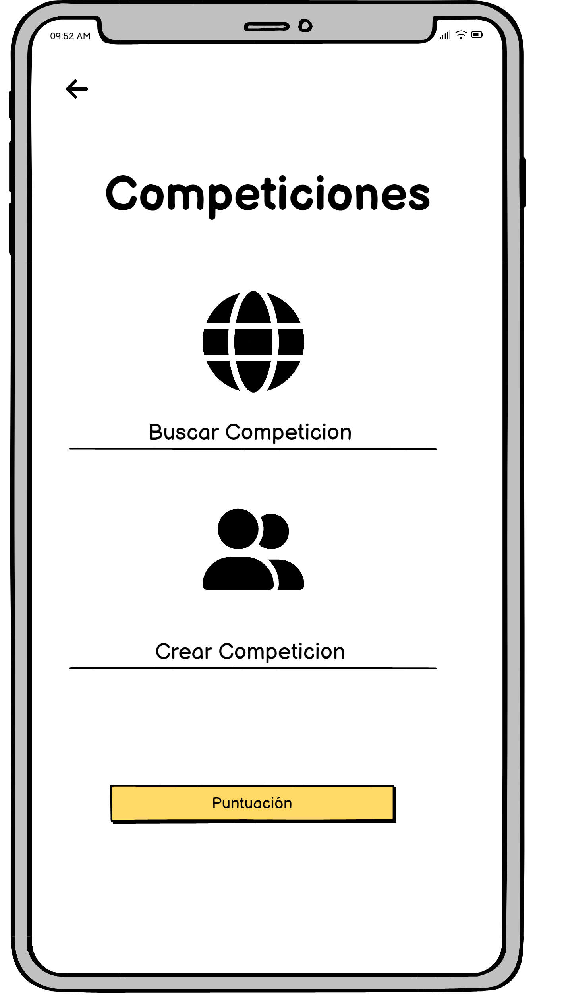
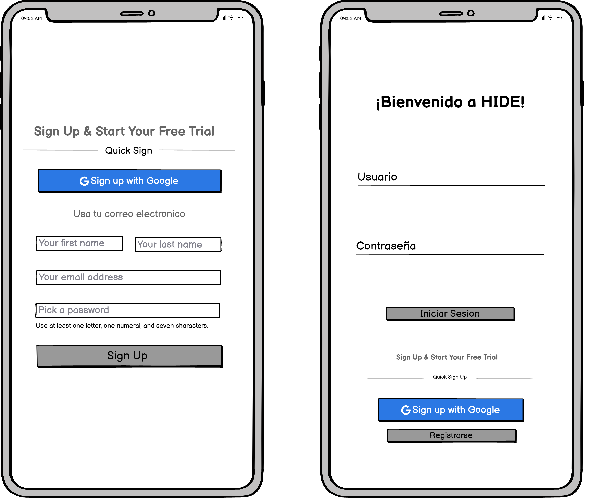
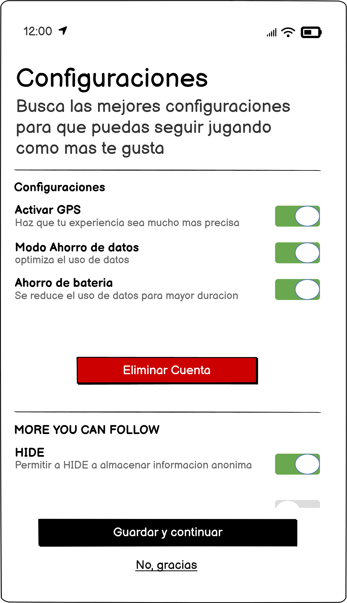
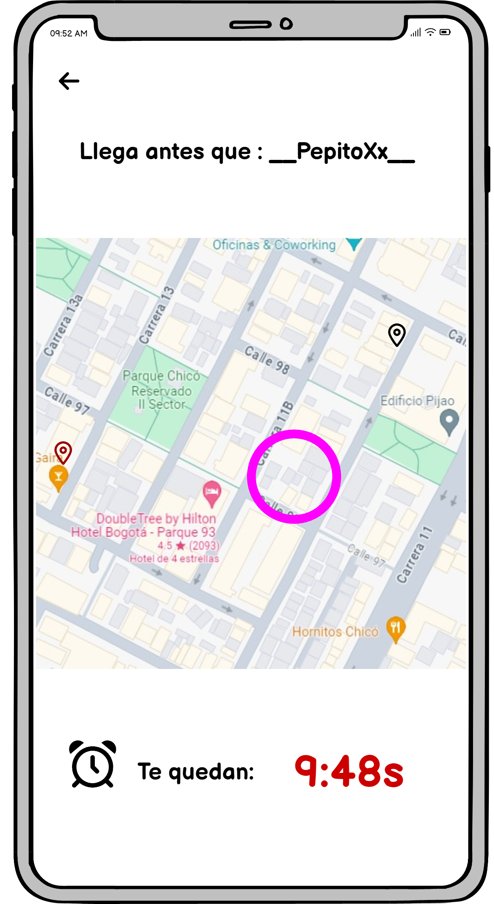

# Proyecto HID - Golden Trio

Bienvenido al repositorio del proyecto del grupo Golden Trio. En este proyecto, nos enfocamos en desarrollar nuestra aplicacion movil.

## Integrantes

### Lucas Rivera Mora

  

Me llamo Lucas Rivera, soy de quinto semestre de ingeniería de sistemas. Uno de mis proyectos pasados fue una aplicación llamada Uniride, que pretendía remplazar los grupos de wheels en WhatsApp. Soy creativo y bueno trabajando en equipo. Y unos de mis hobbies son: el voleibol y los videojuegos.

### Juan Palacios Bermudez

  

Mi nombre es Juan José Bermúdez Palacios, tengo 19 años , soy una persona muy dedicada con mis estudios y crecimiento personal, me gusta ir al gymnasio y practicar fútbol, soy hincha de millonarios y me encanta el fútbol . Estudio ingeniería de sistemas en la pontificia universidad Javeriana, estoy en 5 semestre , me gusta mi carrera y estudiar bastante .

### Camilo Andres Hernandez Zapata

  

Breve descripción:
Me llamo Camilo Hernandez, soy estudiante de ingenieria de sistemas en sexto semestre, me gusta el deporte y el desarrollo personal, uno de mis proyectos pasados fue la creacion de una maquina de automatizacion de hamburgesas.

## Descripción del Proyecto

La aplicación móvil "HIDE" propone una experiencia única y emocionante al organizar competiciones entre amigos basadas en la geolocalización y la interacción fotográfica. Diseñada para fortalecer los lazos sociales, HIDE utiliza tecnologías avanzadas como el GPS, la cámara y el reconocimiento facial para proporcionar una experiencia de vanguardia en dispositivos móviles.

## Diagrama de casos de uso

## Diagrama de clases

## Pantallas principales 

  
  
  
  

## Instalación
Aqui le mostraremos el paso a paso de como instalar nuestra aplicacion HIDE
## Uso

En este apartado le daremos las instrucciones de como va a usar nuestra aplicacion movil (HIDE)
## Contribuciones

Siéntete libre de contribuir al proyecto. Puedes informar problemas, enviar solicitudes de extracción o sugerir mejoras.

## Licencia

Este proyecto está bajo la licencia GNU General Public License v3.0. Consulta el archivo LICENSE.md para obtener más detalles.

